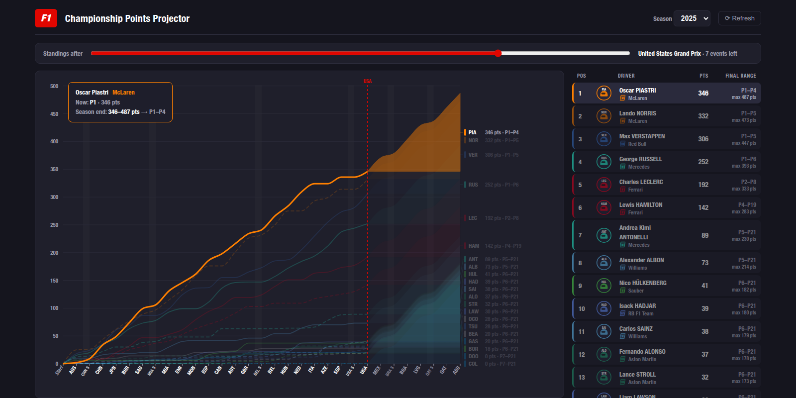

# Championship Points Projector (CPP) — F1 · MotoGP · Moto2 · Moto3

A web app that visualizes drivers'/riders' points progress through a season and the
range of final championship positions each one can still reach, rendered as a
fan/sankey-style uncertainty plot in an f1.com-inspired dark theme. Covers Formula 1
(1950–today) and MotoGP/Moto2/Moto3.



## What it shows

- **Solid lines** — actual cumulative points per driver after every completed event.
  Sprints are separate (narrower) steps from Grands Prix. Second car of each team is dashed.
- **Shaded bands** — the possible cumulative points window for upcoming events:
  the lower edge assumes the driver scores nothing more, the upper edge assumes maximum
  points (win + any applicable bonuses) in every remaining race and sprint.
- **Drivers/Riders & Constructors** — toggle between both championships. F1 constructors:
  both cars score since 1979, best car only 1958–1978, not contested before 1958 (toggle
  disabled); totals are reconciled against official standings. Moto constructors: only
  the best-placed bike of each constructor scores, in races and sprints alike.
- **Final range** — attainable final classification per driver (e.g. `P1–P4`), derived
  from the bounds: a position is unreachable only if another driver's *guaranteed* total
  already beats this driver's *maximum*. Ties are counted pessimistically.
- **Time scrubber** — rewind the season to any past event (back to the pre-season start)
  and see what the championship picture looked like at that moment: drag the red cutoff
  line directly in the chart, or use the slider. Finished seasons default to ~75%
  distance, where the run-in is interesting.
- **Y scale** — fixed to the season's maximum attainable points by default so the axis
  doesn't jump while scrubbing; tick "Auto-adjust Y scale" for a tight fit instead.
- **Per-race results** — click any event on the x axis for its full classification
  (position, driver, team, points, DNF reason); navigate between events with ‹ › or
  arrow keys.

Works for any season from 1950 to the current one (season selector in the header).

## Data sources

**Formula 1** results come from the [Jolpica-F1 API](https://github.com/jolpica/jolpica-f1)
(the community successor of Ergast), which mirrors official **formula1.com** classifications.
Points already scored are taken verbatim from the official results — so fastest-lap
bonuses, half points for shortened races, and stewards' decisions are reflected exactly
as awarded. Season scoring rules (`src/data/scoring.ts`) are only used to project the
*maximum* available points in upcoming events, per era:

| Era | Race | Fastest lap | Sprint |
|---|---|---|---|
| 2025– | 25–1 (top 10) | — | 8–1 (top 8) |
| 2022–2024 | 25–1 | +1 | 8–1 |
| 2021 | 25–1 | +1 | 3–2–1 |
| 2019–2020 | 25–1 | +1 | — |
| 2010–2018 | 25–1 (2014: double finale) | — | — |
| 2003–2009 | 10–1 (top 8) | — | — |
| 1991–2002 | 10–1 (top 6) | — | — |
| ≤1990 | era-specific | varies | — |

**MotoGP / Moto2 / Moto3** results come from the unofficial **motogp.com** results API
(© Dorna Sports, not affiliated; endpoints documented by
[robschmitt/MotoGP-API](https://github.com/robschmitt/MotoGP-API)). That API rejects
requests carrying a browser `Origin` header, so the dev/preview server proxies it
(`/api/motogp`, see `vite.config.ts`). When the proxy or the API is unavailable, the app
shows a "data is not available" fallback notice instead — the same fallback covers
Jolpica/F1 outages. Two robustness details: red-flagged restarted races leave two race
sessions in the API and only the points-bearing one is counted; and post-race penalties
that only appear in the official standings (not in per-race classifications) are
reconciled by applying the difference at the latest completed event. Scoring: top 15
score 25–1; MotoGP-class sprints since 2023 pay 12–1 for the top 9.

Responses are cached in `localStorage` (finished seasons forever, the live season for
1 hour — use the ⟳ Refresh button to force a re-fetch).

## Known caveats

- Projections assume every remaining scheduled event takes place. A cancelled race
  tightens every band; the chart updates automatically once the schedule changes.
- Upper bounds assume full points; shortened races can award half points.
- Before 1991 only a driver's best N results counted toward the championship
  ("dropped scores"). The chart plots gross points, so totals for those seasons can
  exceed the official championship totals. Modern seasons match exactly.
- Driver avatars and team icons are generated SVGs (no official logos, fonts, or
  likenesses); team colors follow the familiar f1.com palette.

## Development

```bash
npm install
npm run dev        # start dev server
npm run build      # type-check + production build
npm run verify       # cross-check F1 totals vs official standings (e.g. npm run verify -- 2025)
npm run verify:moto  # same for bikes (e.g. npm run verify:moto -- moto3 2026)
npm run screenshot   # headless screenshot via Playwright (needs: npx playwright install chromium)
```

## Deployment (Cloudflare Pages)

The repo is ready for Cloudflare Pages with GitHub integration:

1. Push to GitHub.
2. Cloudflare dashboard → **Workers & Pages → Create → Pages → Connect to Git**, pick the
   repo, set **build command** `npm run build` and **build output directory** `dist`.
3. Done. `functions/api/motogp/[[path]].js` is picked up automatically and serves the
   MotoGP proxy in production (the local equivalent lives in `vite.config.ts`);
   `.node-version` pins Node 22 for the build.

Any purely static host (e.g. GitHub Pages) also works, but without the proxy the
MotoGP/Moto2/Moto3 series will show the "data not available" fallback — Formula 1 is
unaffected.

## Architecture

```
src/
  data/api.ts      Jolpica client: pagination, retry on 429, localStorage cache
  data/scoring.ts  per-season F1 scoring rules (used only for future-event maxima)
  data/model.ts    F1 season model + shared projection math (min/max, rank ranges)
  data/motogp.ts   unofficial motogp.com adapter (MotoGP/Moto2/Moto3)
  data/series.ts   series registry: label, season range, loader, cache, source credit
  theme.ts         f1.com-style UI palette + team colors by constructorId
  components/
    Chart.tsx      the uncertainty fan chart (SVG)
    Standings.tsx  standings panel with final-range column
    Icons.tsx      generated driver/team SVG icons
    About.tsx      credits / thanks / disclaimer modal
  App.tsx          series & season selectors, time scrubber, fallback notice, layout
scripts/
  verify.ts        F1 data-integrity check against official standings
  verify-moto.ts   MotoGP/Moto2/Moto3 data-integrity check
  screenshot.mjs   headless render check
```
